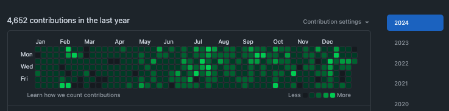

# 2024 のエンジニア活動振り返り

## 技術

仕事で Terraform を触るようになったのが個人的には大きいです（Nextjs は早く慣れたい）。  
プライベートの開発では AWS と格闘したり、OpenSearch に詳しくなりつつあります。

- 今年新たに触れるようになった技術
  - 趣味
    - Rust
    - OpenSearch
  - 仕事
    - Next.js
    - Google Cloud
      - Cloud Run
      - BigQuery
      - Pub/Sub
      - ...
    - Terraform
- 継続して触っている技術
  - Go
  - TypeScript
  - AWS
    - Amplify
    - OpenSearch
    - Lambda
    - ALB
    - ...
  - Python
- やろうと思ってできなかった技術
  - 関数型言語何か
  - 低レイヤーに詳しくなる

来年はもっといろんな技術に触れたい。

## 転職

2024/05/01 に転職し、新しい会社で再びエンジニアとして働いています。  
転職活動時期は 1~3 月くらいで、Findy と LAPRAS を使って求人を探しました。

新しい環境での挑戦は大変ですが、多くのことを学び、成長できてる気がしてます（分からん）。

## プライベート開発

大学時代からの友人に誘われ、新しいプロダクトを作り始めました。
5 月くらいから関わり始め、今は 2 つ目のプロジェクトを進めており、技術的な選択や設計に携わっています。

開発自体は楽しいのですが、8月くらいから業務外のほとんどの時間を割いているので、あまり好きな本を読んだりできてないのが反省です。  
もうちょっと時間の使い方上手くなりたい。

## 読んだ本

4 月に ACM へ入会し『O'Reilly Online Learning』を使えるようになったのですが、前述の通りあまり活用できていません。。。

読んだ本一覧

技術書

- ソフトウェアアーキテクチャメトリクス
  - 4 keys などに対する理解が少し進んだが、具体的な行動・計測に移せていない
- Command-Line Rust
  - 簡単な CLI をいくつか作ったが、Rust の大変なところはあまり触れられてないかも？
- software design 2024/02
- software design 2024/03
- software design 2024/01
- software design 2024/04
- 面倒なことは ChatGPT にやらせよう
- ソフトウェア開発現場の「失敗」集めてみた
- software design 2024/09
- software design 2024/07
- software design 2024/05
- software design 2024/06
- software design 2024/07
- software design 2024/09
- software design 2024/10
- 達人が教える Web パフォーマンスチューニング
- software design 2024/12
- 途中
  - オブジェクト指向設計実践ガイド
  - Rust による Web アプリケーション開発

ビジネス書など

- キャリアーロジック
- マンガでわかる組織開発
- 金を使うならカラダに使え
- 静かに退職する若者たち
- The Models
  - SaaS で戦ってきた人の本。めっちゃ近そう。
- 脳が冴える 15 の習慣
- 人が増えても速くならない
  - プログラムは最も低い品質に引っ張られる
- アーキテクトの教科書
- 「エンジニア×スタートアップ」こそ、最高のキャリアである
- 松岡まどか、起業します AI スタートアップ戦記
- 書けないんじゃない、考えてないだけ
- 時間は存在しない
- あっという間に人は死ぬから
- コード ✖️ AI
- STARTUP 優れた起業家は何を考え、どう行動したか

## その他

### できた点

- イベント参加
  - connpass などでイベントに参加した
    - 5 回くらいオフラインで参加できた
  - ISUCON に参加した
    - 来年はもっと戦えるようになりたい
- 資格とか
  - 12/16 に Professional Cloud Architect の資格を取得した
- ブログ執筆
  - やったこと・気づいたことをメモしている
  - 頻度が落ちつつあるので、来年はもう少し頑張りたい
    - 2024 / 10 (6)
    - 2024 / 8 (2)
    - 2024 / 7 (5)
    - 2024 / 5 (1)
    - 2024 / 4 (2)
    - 2024 / 3 (2)
    - 2024 / 2 (4)
    - 2024 / 1 (7)
  - 会社の tech blog にも 1 本投稿できた
- 諸々の SaaS などに課金するハードルが下がった
  - ちょっとでも楽になるなら安い

### できなかった点

- 何かしらのイベントで登壇する
- 英語力の向上
  - 必要性がなかったので
- 生成 AI を使いこなす
- モバイルの開発
  - そろそろ忘れつつある...

## おわりに

気づいたらエンジニアになって 4 年目が終わりつつあります。  
できることの幅や深さがあまり広がっていない気がしているので、来年はもっといろんなことにチャレンジしていきたいです。
