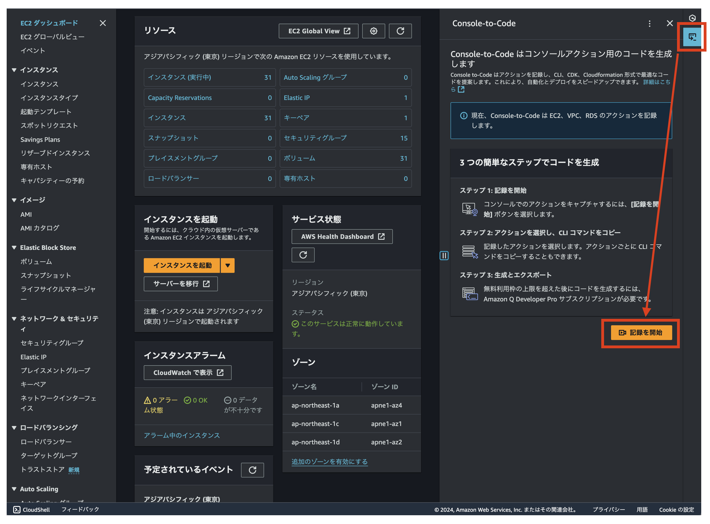
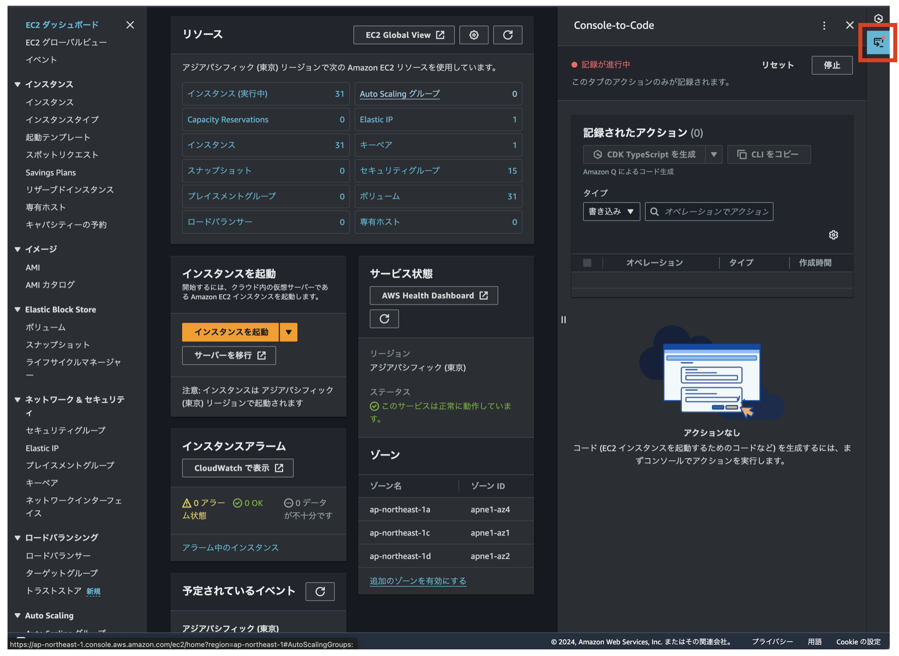
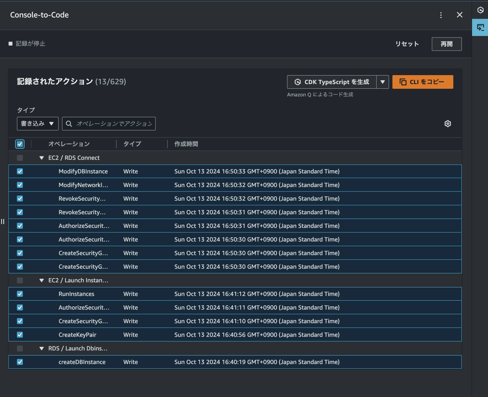
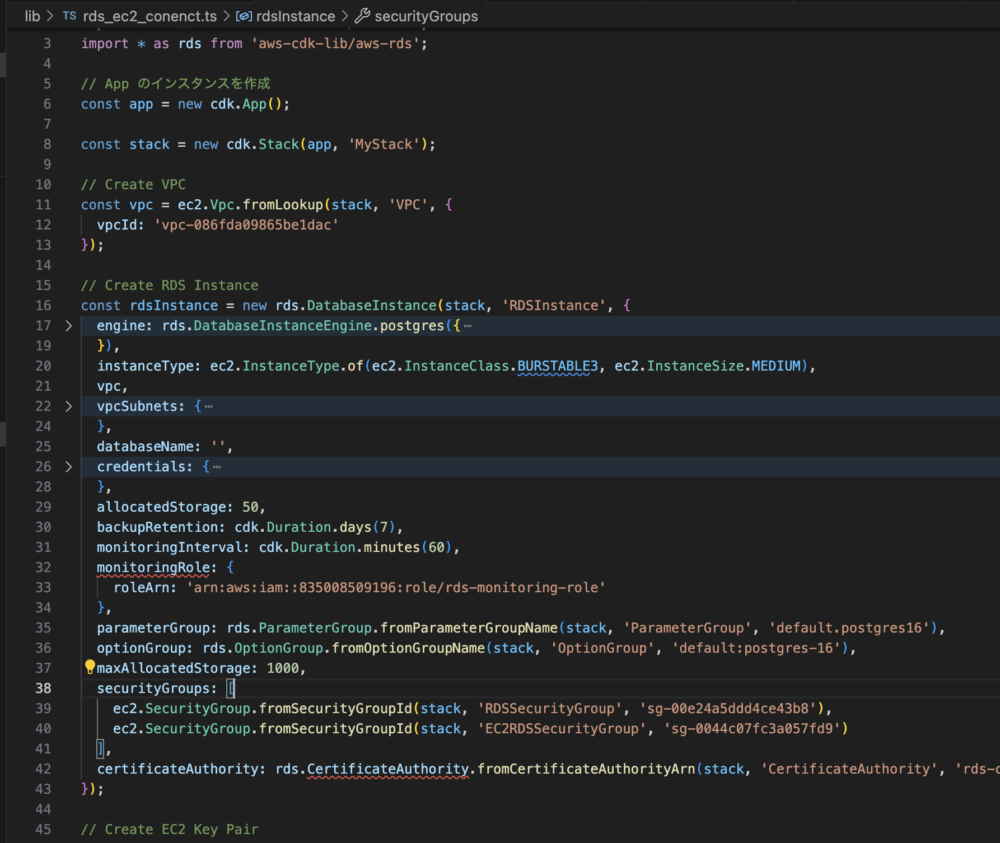
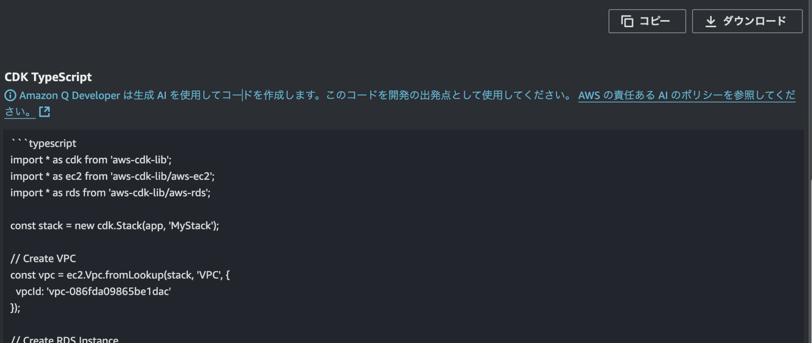

# AWS Console-to-Code 使ってみた

[AWS Console-to-Code という機能が 2024/10/10 に GA されました](https://aws.amazon.com/jp/blogs/aws/convert-aws-console-actions-to-reusable-code-with-aws-console-to-code-now-generally-available/)

AWS コンソールでの操作をコードに変換し、再利用可能な形でエクスポートできるという、非常に便利そうな機能です。  
しかし、実際に試してみた結論としては、Amazon Q による推論が思ったほど賢くなく、CLI や CDK に変換されたコードももう少しかなと感じました。

## AWS Console-to-Code のフロー

### コンソール操作をキャプチャ

まずは AWS コンソール上で特定のアクションをキャプチャします。  
例えば EC2 インスタンスを起動したり、RDS を新規作成したりする操作です。

2024/10/14 現時点でサポートしてるサービスは『EC2, RDS, VPC』の 3 つであることに注意します。

> Support for more services – During preview, the only supported service was Amazon EC2. 
> At GA, AWS Console-to-Code has extended support to include 
> Amazon Relational Database Service (RDS) and Amazon Virtual Private Cloud (Amazon VPC).

例えば、EC2 のコンソールを開いた状態で『記録を開始』を押すとスタートです！



『このタブのアクションのみが記録されます。』とあるように、**タブを新規で開くなどした場合は記録が引き継がれない**ことに注意が必要です。  
（記録中はアイコンの右上に赤い丸がつくので、そこをみてれば良さそうです。）



### コード生成

一通り記録が終わったら、コードを取得できます。



対象は、現在では『CLI, CDK, CloudFormation』の 3 タイプをサポートしてそうです。

今回は『RDS の作成、EC2 の作成、EC2 から RDS への接続』を記録してみました。

### コード確認

生成された CLI の 1 つ目（RDS の作成）を実行してみます。

``` sh
$ aws rds create-db-instance --engine "postgres" --engine-version "16.3" --engine-lifecycle-support "open-source-rds-extended-support-disabled" \
 --db-instance-identifier "c2c-test-db" --master-username "postgres" --db-instance-class "db.t3.medium" \
 --db-subnet-group-name "default-vpc-086fda09865be1dac" --db-name "" --character-set-name 'null' \
 --nchar-character-set-name 'null' --vpc-security-group-ids "sg-00e24a5ddd4ce43b8" --db-security-groups 'null' \
 --availability-zone 'null' --port "5432" --storage-type "gp3" --allocated-storage "50" --iops 'null' \
 --storage-throughput 'null' --kms-key-id 'null' --preferred-maintenance-window 'null' --preferred-backup-window 'null' \
 --backup-retention-period "7" --performance-insights-kmskey-id 'null' --performance-insights-retention-period "7" \
 --monitoring-role-arn "arn:aws:iam::835008509196:role/rds-monitoring-role" --monitoring-interval "60" --domain 'null' \
 --domain-iam-role-name 'null' --domain-fqdn 'null' --domain-ou 'null' --domain-auth-secret-arn 'null' --domain-dns-ips 'null' \
 --db-parameter-group-name "default.postgres16" --option-group-name "default:postgres-16" --timezone 'null' --processor-features 'null' \
 --max-allocated-storage "1000" --network-type 'null' --backup-target 'null' --ca-certificate-identifier "rds-ca-rsa2048-g1"


usage: aws [options] <command> <subcommand> [<subcommand> ...] [parameters]
To see help text, you can run:

  aws help
  aws <command> help
  aws <command> <subcommand> help

Unknown options: --engine-lifecycle-support, --performance-insights-kmskey-id, null, open-source-rds-extended-support-disabled
```

CLI のオプションが間違ってると怒られてしまいました。

次に CDK の生成コードも試してみます。



引数の型が違うと怒られてしまいました。



コンソールを見ても、

> Amazon Q Developer は生成 AI を使用してコードを生成します。
> このコードを開発の出発点として使用してください。

とあるように、**生成したまままるっと使えるような想定ではない**ようです。  
（生成 AI じゃなくて普通にロジック的な変換はできないのかな。。。）

## 感想

何回か試してみましたが、生成されたまままともに動くものが出なかったのは残念でした。  
CLI や CDK にそもそも慣れてないと、現状では使いこなせなさそうです。  
（CloudFormation は馴染みがなかったので試してないのですが、もしかしたらもう少し精度いいかもしれません。）

今後、対象サービスが増えるとともに精度も上がっていくことを期待です！
