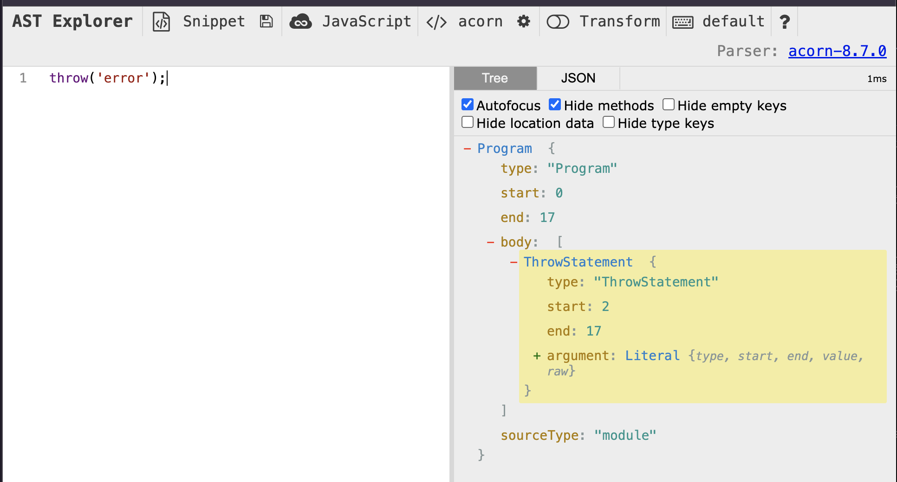

# CLAUDE.md の「お願い」を ESLint カスタムルールに落とす

AI エージェント（Claude Code など）に守らせたいコード規約を `CLAUDE.md` への「お願い」で終わらせず、静的に検査できるものは linter に落とし込む、という考え方と実際にやってみた話です。

## 目次

* [目次](#目次)
* [環境](#環境)
* [この記事で伝えたいこと](#この記事で伝えたいこと)
* [なぜ CLAUDE.md に書くだけでは守られないのか](#なぜCLAUDEmdに書くだけでは守られないのか)
* [実例 throw を禁止して Result 型を強制する](#実例throwを禁止してResult型を強制する)
* [おわりに](#おわりに)

## 環境

本記事のコードは ESLint v9 系の flat config（`eslint.config.mjs`）を前提としています。

<!-- more -->

## この記事で伝えたいこと

規約には 2 種類あります。『レビューでしか判断できないもの』と『機械的に判定できるもの』です。
後者、たとえば『server 層で throw を使わない』や『層を跨ぐ相対 import をしない』といったものは、AST を見れば決定論的に yes / no が付きます。
決定論的に判定できるなら、判定は人間や LLM ではなく linter がやるべきだ、というのがこの記事で伝えたいことになります。

## なぜ CLAUDE.md に書くだけでは守られないのか

規約を `CLAUDE.md` に書くのは手軽ですが、守られる保証がありません。理由は 3 つあります。

- 確率的にしか効かない。`CLAUDE.md` の指示は LLM への入力の一部でしかなく、「たぶん守る」以上のものにはならない。守れなかったときに検出する仕組みもない
- コンテキストから抜ける。会話が長くなると文脈は圧縮され、序盤に読んだ規約は後半の実装時には薄れている
- CI で止まらない。`CLAUDE.md` は人間のレビューと同じで、見落とせば通ってしまう。規約違反が main に入っても誰も気づかない

linter に落とすと、この 3 つが全部裏返ります。決定論的に 100 % 検出され、実装のたびに `eslint` が走り、CI で赤くなって PR が止まります。「AI に頼む」から「機械が保証する」に変わります。

これは AI エージェントに書かせるコードが増えるほど効いてきます。人間が 1 行ずつ書いていた頃は目視でも追えましたが、エージェントがまとめて差分を出す時代には、規約は自動で弾かれる形にしておかないと運用が破綻します。

## 実例 throw を禁止して Result 型を強制する

抽象論だけだと弱いので、個人プロダクト [runon](https://github.com/kokoichi206/runon) で実際に運用しているカスタムルールを 1 つ、丸ごと紹介します。

`runon` では server 層のエラー処理を Result 型（`ok()` / `err()` を返す）に統一しています。`throw` は制御フローを暗黙化し、「この関数は失敗しうる」ことを呼び出し側に型で伝えられません。これを `CLAUDE.md` に「throw を使わないで」と書くのではなく、ルールにしました。

ルール本体はこれだけです（[eslint-rules/no-throw-statement/rule.js](https://github.com/kokoichi206/runon/blob/dae9b3f/eslint-rules/no-throw-statement/rule.js)）。

```js
/** @type {import("eslint").Rule.RuleModule} */
export default {
  meta: {
    type: "problem",
    docs: {
      description: "server コードでの throw を禁止し Result 型の使用を強制する",
      recommended: true,
    },
    messages: {
      noThrowStatement:
        "server コードで 'throw' を使わないでください。エラーは @/shared/result の err() を返して表現します。",
    },
    schema: [],
  },

  create(context) {
    return {
      ThrowStatement(node) {
        context.report({ node, messageId: "noThrowStatement" });
      },
    };
  },
};
```

`ThrowStatement` という AST ノードに対して `context.report()` するだけです。ESLint はソースを AST（抽象構文木）に変換して走査するので、「throw 文がある」という構造をこう名指しで捕まえられます。どのノード名かは [AST Explorer](https://astexplorer.net/) で確認するのが早いです。



ルールには必ずテストを添えます。ESLint の `RuleTester` は valid / invalid のコード片を渡すと、期待どおりに検出（あるいは非検出）するかを検証してくれます。

```js
import { RuleTester } from "eslint";
import rule from "./rule.js";

const ruleTester = new RuleTester({
  languageOptions: { ecmaVersion: 2022, sourceType: "module" },
});

ruleTester.run("no-throw-statement", rule, {
  valid: [
    // Result を返す（throw しない）。
    { code: `function f(x) { if (!x) return err("required"); return ok(x); }` },
    // 外部エラーの catch は許可（throw していない）。
    { code: `function f() { try { external(); } catch (cause) { return err(cause); } }` },
  ],
  invalid: [
    {
      code: `throw new Error("boom");`,
      errors: [{ messageId: "noThrowStatement" }],
    },
  ],
});
```

有効化は `eslint.config.mjs` で、対象を server 層に絞って行います。`try` / `catch` で外部例外を受けて `err()` に変換するのは推奨パターンなので、`catch` 自体は禁止しません。禁止するのは `throw` だけです。

```js
import customRules from "./eslint-rules/index.js";

// ...
{
  files: ["src/server/**/*.ts"],
  plugins: { custom: customRules },
  rules: {
    "custom/no-throw-statement": "error",
  },
},
```

これで、server 層に `throw new Error(...)` を書いた瞬間に `eslint` が error を出します。`CLAUDE.md` に「Result 型を使って」と書いていた頃は、エージェントが忘れれば素通りしていました。今は忘れても機械が止めてくれます。ルールに込めた理由（Why）は各ルールの README に書いておくと、後から差分を触る人が安全に変更できます（[no-throw-statement/README.md](https://github.com/kokoichi206/runon/blob/dae9b3f/eslint-rules/no-throw-statement/README.md)）。

```
eslint-rules/
├── index.js               # ルールのエクスポート
└── <rule-name>/
    ├── rule.js            # ルール本体
    ├── test.js            # RuleTester のテスト
    └── README.md          # Why と NG / OK 例
```

AI Agent 以前は lint を作るコストが人間のレビュー・認知コストより高く、ルール化するのは腰が重かったと思います。
AI Agent 時代は、よりレビューのコストを減らすためにも、決定論的な規約を可能な限り増やすことが大切だと考えており、その1つの手段に TypeScript だと ESLint カスタムルールを作ることがあります。
特に ESLint のルールは yes/no がはっきりしているため、テスト含め実装・確認が容易だと思っています。

## おわりに

- 規約には『レビューでしか判断できないもの』と『機械的に判定できるもの』がある。後者は linter に落とす
- `CLAUDE.md` への指示は確率的にしか効かず、コンテキストから抜けるし、CI で止まらない。linter なら決定論的に検出され、PR が止まる
- 結果として `CLAUDE.md` は、linter に落とせないもの（設計判断や文脈依存の指針）に集中させられる

AI エージェントに書かせる量が増えるほど、『お願い』より『機械が保証する仕組み』の価値が上がります。守らせたい規約が決定論的に判定できるなら、まず linter に落とせないかを考えるのがおすすめです。
