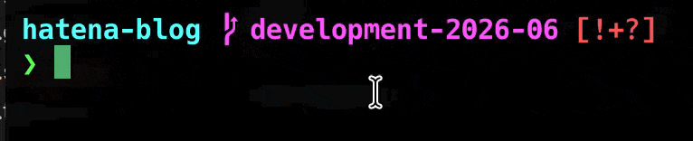
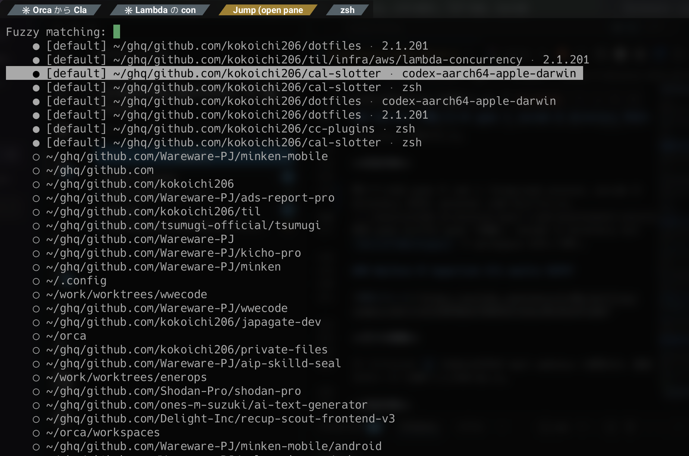
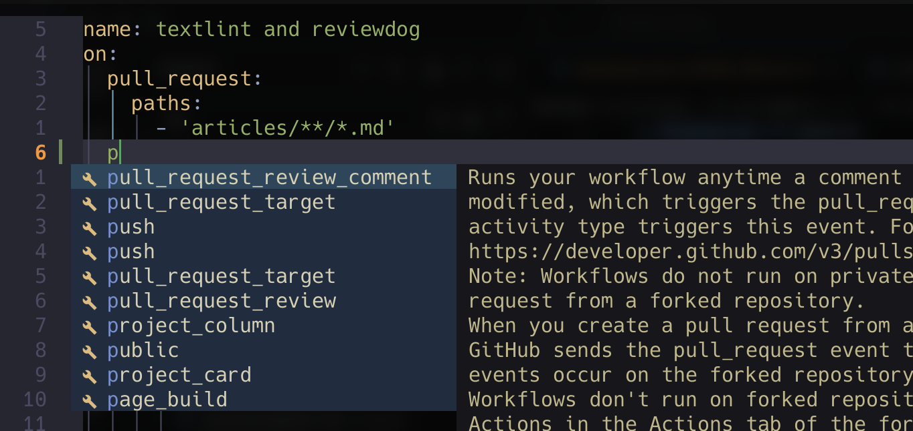

# 開発環境改善メモ[2026/6]

2026 年 6 月に改善した開発環境のメモ。

## 目次

* [目次](#目次)
* [現在の環境](#現在の環境)
* [改善ポイント](#改善ポイント)
  * [pipe 後でも zsh abbreviation を展開する](#pipe-後でも-zsh-abbreviation-を展開する)
  * [path を Ctrl+W / Option+Delete で消しやすくする](#path-を-ctrl+w-/-option+delete-で消しやすくする)
  * [oh-my-zsh を sheldon + starship に置き換える](#oh-my-zsh-を-sheldon-+-starship-に置き換える)
  * [WezTerm で開いている pane と zoxide の directory をまとめて探す](#wezterm-で開いている-pane-と-zoxide-の-directory-をまとめて探す)
  * [WezTerm の hyperlink から mailto を外す](#wezterm-の-hyperlink-から-mailto-を外す)
  * [nvim で JSON / YAML 編集時に SchemaStore の補完を効かせる](#nvim-で-json-/-yaml-編集時に-schemastore-の補完を効かせる)
  * [lazygit から Claude で commit message を作る](#lazygit-から-claude-で-commit-message-を作る)


## 現在の環境

- PC: macOS / m4 Mac mini
- Terminal: WezTerm
- Shell: zsh
- Shell 周辺: sheldon, starship, zsh-abbr, fzf-tab, zoxide
- Editor: VSCode / Windsurf, Zed, Neovim
- 環境管理: nix-darwin, home-manager, mise, Homebrew
- AI 開発支援: Claude Code, Codex

## 改善ポイント

### pipe 後でも zsh abbreviation を展開する

[対応コミット](https://github.com/kokoichi206/dotfiles/commit/ef624bbd5a9e834f776ef844536fa8d682f2c6b7)

**元々の課題**

`zsh-abbr` で `pc` を `pbcopy` にしていても、pipe の後では展開されなかった。

```sh
$ abbr --version
zsh-abbr version 6.5.2

# pc => pbcopy の展開が pipe 後だと走らない
$ echo 'hoge' | pc

# 期待する変化
0. $ echo 'hoge' | pc
1. $ echo 'hoge' | pc[space]
2. $ echo 'hoge' | pbcopy
```

**対応内容**

`.zshrc` で、command position にある regular abbreviation を展開する実験的設定を有効にした。`sheldon` が `zsh-abbr` を読む前に設定する必要があるので、plugin 読み込みより上に置いている。

```sh
export ABBR_EXPERIMENTAL_COMMAND_POSITION_REGULAR_ABBREVIATIONS=2
```



**良くなったこと**

`cat file | pc` や `git diff | pc` のように、pipe 後でも普段の短縮入力がそのまま使えるようになった。alias と違って展開後のコマンドが履歴に残るので、あとから見返しても分かりやすい。

### path を Ctrl+W / Option+Delete で消しやすくする

[対応コミット](https://github.com/kokoichi206/dotfiles/commit/2b43a4aa9081a51e28be9839bc0dbca318bcc3cd)

**元々の課題**

zsh の word boundary が普段扱う path や branch 名の規約と合っておらず、`foo/bar/baz` や `origin/main` を消す時に、期待より大きい単位で削除されることがあった。

``` sh
0. cd /path/to/dir/subdir
1. Ctrl+W
2. cd

# 期待する変化
0. cd /path/to/dir/subdir
1. Ctrl+W
2. cd /path/to/dir/
3. cd /path/to/dir/different-dir
```

**対応内容**

`.zshrc` で `WORDCHARS` から `/` を抜いた。

```sh
WORDCHARS=${WORDCHARS:s@/@}
```

### oh-my-zsh を sheldon + starship に置き換える

[対応コミット](https://github.com/kokoichi206/dotfiles/commit/61fbb8be02cd81adbe69fc38fb5afb34ff045e8f)

**元々の課題**

claude code 等で shell を複数起動する時に、shell の起動にそれなりの時間がかかってしまっていた。

**対応内容**

- plugin => `.config/sheldon/plugins.toml`
- prompt => `.config/starship.toml`

### WezTerm で開いている pane と zoxide の directory をまとめて探す

[対応コミット](https://github.com/kokoichi206/dotfiles/commit/bd43dc7eb555dea2acbc0556666e8720ee2dfb17)

**元々の課題**

WezTerm の workspace / tab / pane と、zoxide の最近使った directory が別々だった。

**対応内容**

開いている全 pane の cwd と foreground process、zoxide の directory を同じ selector に並べるようにした。

既存 pane ならその pane へ移動し、zoxide の directory なら `SwitchToWorkspace` で workspace を作って開く。



### WezTerm の hyperlink から mailto を外す

[対応コミット](https://github.com/kokoichi206/dotfiles/commit/5677713c230584a476b6941fe4acd9c9eaf5fa6d)

**元々の課題**

ターミナル上の `@` を含む文字列が mail address と解釈され、意図せずメーラーが開いてしまっていた。

**対応内容**

`.config/wezterm/wezterm.lua` で `wezterm.default_hyperlink_rules()` から `mailto:` の rule だけ除外した。

```lua
config.hyperlink_rules = {}
for _, rule in ipairs(wezterm.default_hyperlink_rules()) do
  if not rule.format:find("mailto:") then
    table.insert(config.hyperlink_rules, rule)
  end
end
```

### nvim で JSON / YAML 編集時に SchemaStore の補完を効かせる

[対応コミット](https://github.com/kokoichi206/dotfiles/commit/07e0ea0a5e82f37854589d894d508f5e7af81194)

**元々の課題**

GitHub Actions、docker-compose、package.json、tsconfig など、JSON / YAML の設定ファイルを書く時に schema 由来の補完や validation が弱かった。

**対応内容**

`.config/nvim/lua/plugins/lsp.lua` に `b0o/schemastore.nvim` を追加し、jsonls / yamlls と連携する前提を作った。

```lua
"b0o/schemastore.nvim",
```



**Links**

- [JSON Schema Store](https://www.schemastore.org/)

### lazygit から Claude で commit message を作る

[対応コミット](https://github.com/kokoichi206/dotfiles/commit/a3de3d3f49d8ccb9a878e64faab8a33eaf90c894)

**元々の課題**

staged diff を見て commit message を考える作業が毎回少し重かった。特に細かい dotfiles 変更では、内容を正確に短くまとめるのが面倒だった。

**対応内容**

`.config/lazygit/config.yml` に custom command を追加し、`git diff --cached` を Claude に渡して日本語の commit message を生成するようにした。

```yaml
customCommands:
  - key: "G"
    context: "files"
    description: "AI commit message (Claude)"
    command: >-
      git diff --cached | claude -p '簡潔なコミットメッセージを日本語で生成して。コミットメッセージのみを出力。feat: や fix: のような prefix は不要。1行目は72文字以内。変更が単純なら1行、複雑なら空行を挟んで本文を追加。' > /tmp/lazygit-ai-commit-msg.txt && git commit -e -F /tmp/lazygit-ai-commit-msg.txt && rm -f /tmp/lazygit-ai-commit-msg.txt
```
