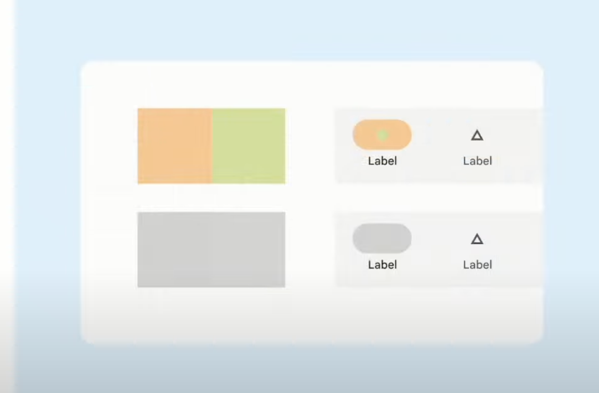

# 高品質のアプリを作る方法

[Designing a high quality app with the latest Android features](https://www.youtube.com/watch?v=922ADxreYDY&list=PLWz5rJ2EKKc8PO99T1QQLrPAJILqxJXW6&index=18&ab_channel=AndroidDevelopers)

## edge to edge


## predictive back

> Android の将来のバージョンでは、予測型「戻る」ジェスチャーは以下のアニメーションのように動作します。できるだけ早くこれらの変更を実装することを強くおすすめします。

```xml
<application
    ...
    android:enableOnBackInvokedCallback="true"
    ...
```

上記を有効にすると、以下 API は無効になる

- `KEYCODE_BACK`
- `onBackPressed()`

## Accessible color system

dynamic color についてのお話。

### Accessible

Design for everyone



Contrast ratio を上げる！

## Links

Google Documents

- [Display content edge-to-edge in your app](https://developer.android.com/develop/ui/views/layout/edge-to-edge)
- [Floating action buttons](https://developer.android.com/jetpack/compose/layouts/material#fab)
- [Add support for the predictive back gesture](https://developer.android.com/guide/navigation/predictive-back-gesture)
  - [Codelab](https://codelabs.developers.google.com/handling-gesture-back-navigation#0)
