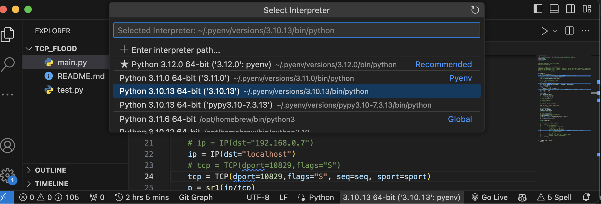

# VSCode で Python の定義にジャンプできないときは、インタープリターを確認する

ターミナルでは動く Python のコードなのに、VSCode から外部ライブラリの定義へジャンプできないことがありました。

自分の環境では、pyenv で使っていた Python と、VSCode で選択していた Python が違っていました。インタープリターを実行環境に合わせると、ライブラリの参照も解決しました。

同じ症状なら、まず Python のバージョンと実行ファイルのパスを確認します。

[:contents]

## ターミナルで使っている Python を確認する

コードが動いているターミナルで、次を実行します。

```sh
python -c "import sys; print(sys.executable); print(sys.version)"
```

普段 `python3` で実行しているなら、このコマンドも `python3` に置き換えます。

1 行目が実行中の Python のパス、2 行目以降がバージョン情報です。`sys.executable` の意味は [Python の公式ドキュメント](https://docs.python.org/3/library/sys.html#sys.executable)でも確認できます。

同じバージョンの Python でも、仮想環境ごとにライブラリのインストール先は分かれています。バージョン番号だけをそろえて終わりにせず、パスも控えておきます。

## VSCode のインタープリターを合わせる

1. 対象プロジェクトの Python ファイルを開く。
2. コマンドパレットから『Python: Select Interpreter』を実行する。
3. 先ほど確認した Python のパスに対応する環境を選ぶ。

画面下部のステータスバーにある Python のバージョン表示からも選択できます。以下は初回執筆時の画面です。



選択した環境はコードの実行だけでなく、IntelliSense などの言語機能にも使われます。[VSCode の環境選択の説明](https://code.visualstudio.com/docs/python/environments#_select-an-environment)

pyenv を使っていても、プロジェクトを仮想環境で動かしているなら、その仮想環境を選びます。pyenv 側の Python を選ぶだけで、仮想環境に入れたライブラリまで見えるわけではありません。

## 外部ライブラリの定義に移動できるか確認する

元々ジャンプできなかったライブラリの関数を右クリックし、『Go to Definition』を実行します。既定のショートカットは `F12` です。[定義への移動の説明](https://code.visualstudio.com/docs/python/editing#_navigation)

まだ参照できない場合は、選択した Python でそのライブラリを import できるか確認します。次は `requests` の例で、Python のパスとモジュール名は自分の環境に置き換えます。

```sh
"/absolute/path/to/python" -c "import requests; print(requests.__file__)"
```

`ModuleNotFoundError` になる場合、その Python ではモジュールを見つけられていません。動いていたターミナルと同じ環境を選べているか、先に確認します。ライブラリを入れ直す場合も、プロジェクトで使っている依存関係の管理方法に合わせます。

import できても定義へ移動できない場合は、今回の環境の食い違いだけでは説明できません。対象の関数、自作モジュールでも起きるか、Python 拡張と Pylance の状態を確認する段階です。

なお、補完から import 文を追加したい場合は、[Python の Auto Import の設定](https://koko206.hatenablog.com/entry/2025/01/26/221442)を別記事に書いています。

## 更新時の確認範囲

2023 年の解決記録に、2026 年 9 月 9 日時点の公式ドキュメントをもとに確認手順を補いました。パスを表示するコマンドは Python 3.13.1 で確認しています。掲載画像は初回執筆時のもので、今回 VSCode 上で当時の不具合を再現したものではありません。
