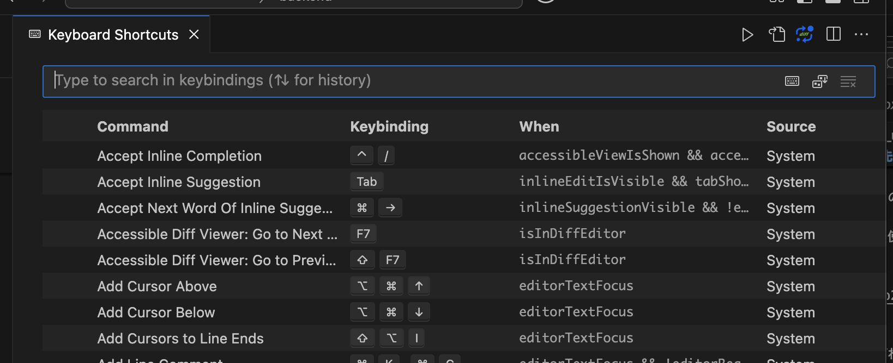
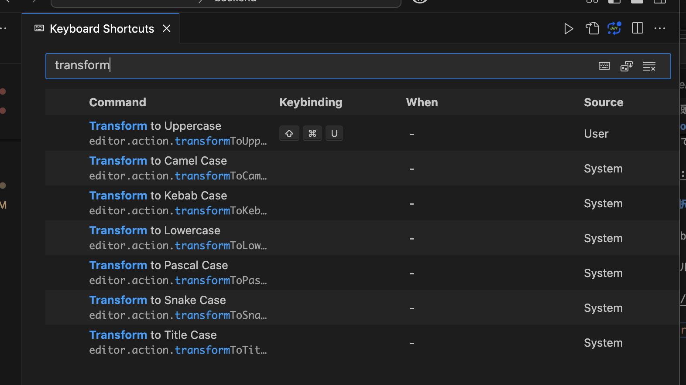
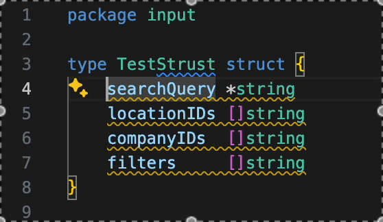
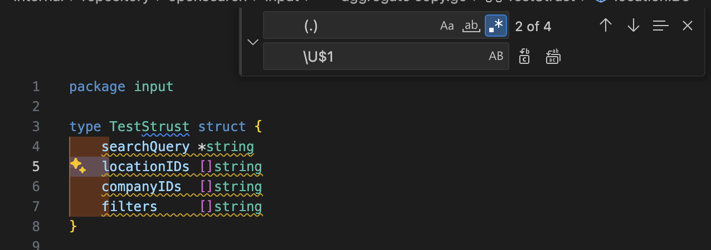

# VSCode で先頭の文字のみを大文字/小文字にするリファクタリング

Go では特に大文字小文字で可視性が決まるため、package を跨いだリファクタリングの際などに  
変数名や関数名の先頭の文字を大文字/小文字に変更することが多々発生します。

以前正規表現を使った方法を紹介していたのですが、VSCode 標準でできそうだったのでその紹介です。

https://koko206.hatenablog.com/entry/2024/02/05/021412

<!-- more -->

## 選択されてる箇所を大文字に変換する

**1 Keyboard Shortcuts を開く**

デフォルトでは『Cmd + K』『Cmd + S』で開けます。



**2 `transform` と検索して希望する Command に Keybinding を割り当てる**

自分はデフォルトでは何も割り当たってなかったため `Transform to Uppercase` に `Ctrl + Shift + U` を割り当てました。



他にもキャメルケースに変換する `Transform to Camel Case`, スネークケースに変換する `Transform to Snake Case` などもあるのでぜひ覚えておきましょう。

**3 マルチカーソルと合わせて爆速で置換する**

『Shift + Alt』などでマルチカーソル選択し `Ctrl + Shift + U` をすることで、複数箇所に対し一気に変換できます。



### VSCode の正規表現置換で対応

ちなみに ↑ を VSCode の正規表現置換でやるには以下のようにします。

**対象**

```
	(.)
```

**置換文字列**

```
	\U$1
```



`\U` などを使った変換が可能で、[他にも `L` などがあるそうです。](https://github.com/microsoft/vscode-docs/blob/vnext/release-notes/v1_47.md#case-changing-in-regex-replace)

| modifiers | 説明 |
| --- | --- |
| `\U` | 全てを大文字に変換 |
| `\L` | 全てを小文字に変換 |
| `\u` | 先頭の文字を大文字に変換 |
| `\l` | 先頭の文字を小文字に変換 |

`\u\u\u$1` とすると最初の 3 文字を大文字に変換できるそうです。  
（どこかに使えるかな。。。）

この辺の機能一覧ってどこ見たらわかるんだろうか。。。
