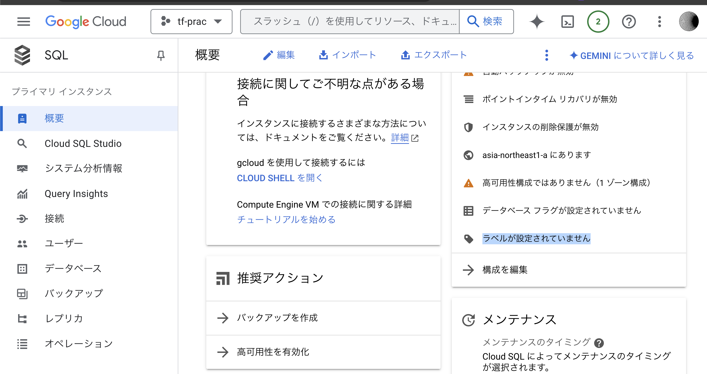

# Google Provider の default_labels は一部リソースにラベルを付与しない

Google provider では [Version 5.0 から default_labels というフィールドが追加され](https://www.hashicorp.com/blog/terraform-google-provider-adds-updates-to-default-labels)、terraform で管理するリソース全体に統一的なラベルを付与できるようになりました。
（[AWS では Google の2年半ほど前から同様の機能が使えるようです](https://www.hashicorp.com/blog/default-tags-in-the-terraform-aws-provider)）

この `default_labels` ですが、`google_sql_database_instance` など**一部のリソースではラベルが付与されない**という話をさせてもらいます。

<!-- more -->

## 再現コード

以下のように `default_labels` を設定した google の provider と、cloud sql のインスタンスを用意する terraform を作成します。

``` tf
provider "google" {
  project = "tf-prac-438213"
  region  = "asia-northeast1"

  default_labels = {
    app = "test-app"
  }
}

terraform {
  required_version = "~> 1.9.0"

  required_providers {
    google = {
      source  = "hashicorp/google"
      version = "~> 5.44.0"
    }
  }
}

resource "google_sql_database_instance" "master" {
  name             = "test-app-db"
  database_version = "MYSQL_8_0"
  region           = "asia-northeast1"
  settings {
    tier = "db-f1-micro"
  }
}
```

この terraform で適応した場合、**ラベルは付与されません**。



## 原因

この内容は [hashicorp/terraform-provider-google の Issue](terrhttps://github.com/hashicorp/terraform-provider-google/issues/16375#issuecomment-2289955256) にも上がっており、どうやら**各リソースの top 階層に label がない場合は default_labels が適応されない**ようです。
（この Issue が閉じられる頃には、勝手にここも付与されるようになって欲しい。）

今回の `google_sql_database_instance` の例では, [labels の定義が `settings > user_labels` にある](https://registry.terraform.io/providers/hashicorp/google/latest/docs/resources/sql_database_instance#user_labels)ため、適応対象外となってしまったようです。

## 修正案

今回は Issue にある方法で、[google_client_config](https://registry.terraform.io/providers/hashicorp/google/latest/docs/data-sources/client_config) という data ソースを経由することで解決しました。

``` tf
data "google_client_config" "current" {
}

resource "google_sql_database_instance" "master" {
  name             = "test-app-db"
  database_version = "MYSQL_8_0"
  region           = "asia-northeast1"
  settings {
    tier = "db-f1-micro"

    // 各リソースの top 階層に label がない場合は default_labels が適応されない。
    // https://github.com/hashicorp/terraform-provider-google/issues/16375#issuecomment-2289955256
    user_labels = data.google_client_config.current.default_labels
  }
}
```

``` sh
$ terraform apply
...

Terraform will perform the following actions:

  # google_sql_database_instance.master will be updated in-place
  ~ resource "google_sql_database_instance" "master" {
        id                             = "test-app-db"
        name                           = "test-app-db"
        # (18 unchanged attributes hidden)

      ~ settings {
          ~ user_labels                  = {
              + "app" = "test-app"
            }
            # (16 unchanged attributes hidden)

            # (3 unchanged blocks hidden)
        }
    }
```

terraform 適応後は、ラベルが付与されていることが確認できます。

``` sh
$ gcloud sql instances describe test-app-db --project=tf-prac-438213 --format="json" |\
 jq '.settings.userLabels'

{
  "app": "test-app"
}
```

## おわりに

コンソール上で見た『**ラベル**』が, resource のラベルだったり metadata のラベルだったり user_labels だったりと、なかなか初心者に優しくないことをやってくれてる気がします。。。
（理解したい）
