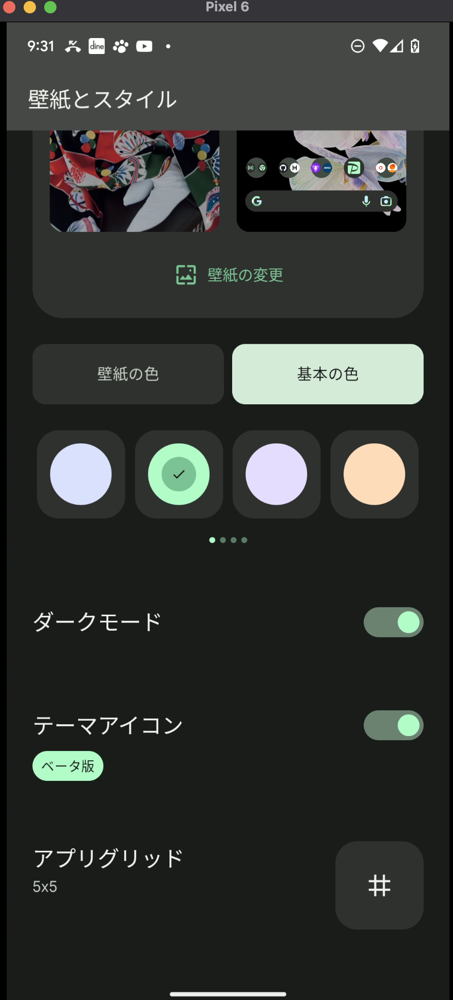
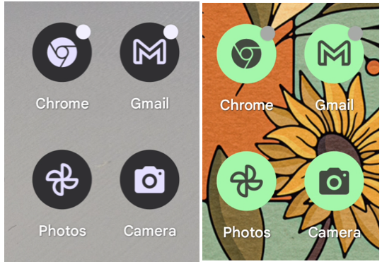
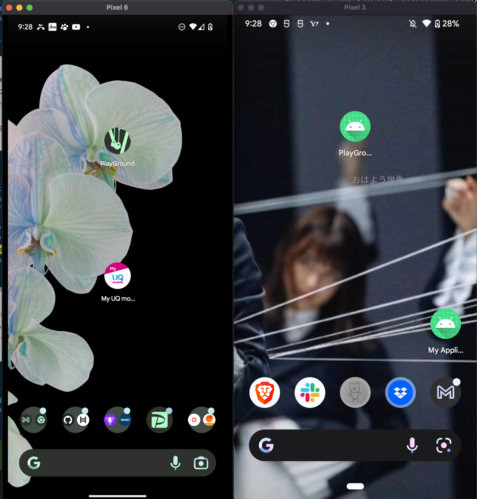
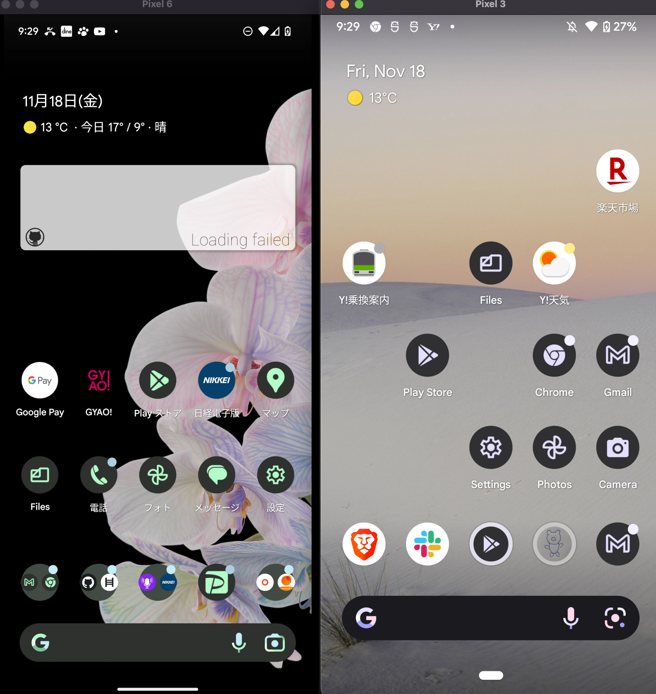

# Android のテーマアイコンを設定する方法と、変わらないときの確認点

Android のテーマアイコンは、壁紙やダークモードに合わせてホーム画面のアイコンの色を変える機能です。端末側の設定に加えて、使っているランチャーや Android のバージョンも関係します。

前半は使う側の設定、後半は自分のアプリに対応を入れる方法です。

[:contents]

## テーマアイコンを有効にする

初回執筆時に確認した端末では、ホーム画面の空いている場所を長押しすると設定が開きました。『壁紙とスタイル』から『テーマアイコン』を有効にします。設定画面は端末やランチャーによって異なります。



対応するアイコンは、壁紙やテーマに合わせた配色で表示されます。Android Developers では themed app icons と呼ばれています。



## テーマアイコンが変わらないとき

設定を有効にしても変わらない場合は、ホーム画面のアイコンを見ながら次を確認します。

| 状況 | 確認すること |
| --- | --- |
| 設定項目が見つからない、どのアイコンも変わらない | 使用中のランチャーがテーマアイコンに対応しているか、設定が有効か |
| 一部のアプリだけ変わらない | Android のバージョンと、そのアプリの単色アイコンへの対応 |
| 自分で対応したアプリが変わらない | アプリが参照しているアイコン XML に `monochrome` を追加できているか |

アプリ側の対応条件は、Android のバージョンで違います。

- Android 13 から Android 16 QPR 2 より前: アプリが単色のアイコンを提供する必要がある。
- Android 16 QPR 2 以降: 単色のアイコンを提供していないアプリも、Android が自動でテーマ化するというのが公式の説明。

どちらもユーザー側の設定とランチャーの対応が前提です。以前の記事にあった「アプリが単色アイコンを提供していなければ表示されない」という条件は、すべてのバージョンには当てはまりません。[Adaptive icons の公式ドキュメント](https://developer.android.com/develop/ui/compose/system/icon_design_adaptive)

## 自分のアプリに単色アイコンを設定する

アプリ側からテーマアイコンを提供する仕組みは、Android 13（API 33）で追加されました。[Android 13 の機能説明](https://developer.android.com/about/versions/13/features#themed-app-icons)

既存の adaptive icon に `monochrome` を追加します。例えば `res/mipmap-anydpi-v26/ic_launcher.xml` を使っているアプリなら、次の形です。

```xml
<?xml version="1.0" encoding="utf-8"?>
<adaptive-icon xmlns:android="http://schemas.android.com/apk/res/android">
    <background android:drawable="@drawable/ic_launcher_background" />
    <foreground android:drawable="@drawable/ic_launcher_foreground" />
    <monochrome android:drawable="@drawable/playground" />
</adaptive-icon>
```

`@drawable/playground` は元のアプリで使ったリソース名です。自分のアプリでは、テーマアイコン用に用意した drawable の名前に置き換えます。背景と前景のリソースも既存のものを使います。

SVG を素材にする場合は、Android Studio の『New > Vector Asset』で取り込み、Android の VectorDrawable XML に変換します。SVG ファイルをそのまま drawable として参照する手順ではありません。[Vector Asset Studio の説明](https://developer.android.com/studio/write/vector-asset-studio)

ファイルを追加したら、`AndroidManifest.xml` を開きます。`application` の `android:icon` が、編集したアイコンを参照しているか確認します。`android:roundIcon` も指定している場合は、その参照先の単色レイヤーも確認します。[アイコンリソースの指定方法](https://developer.android.com/develop/ui/compose/system/icon_design_adaptive#add-to-app)

## Android 13 と Android 12 で確認した見た目

左が Android 13、右が Android 12 で、中央付近の自作アプリを比較しています。



当時の端末では、Android 12 側でも一部のプリインストールアプリはテーマに対応していました。Play Store や Settings、Photos などです。



この比較は当時使った端末での結果です。Android 12 のすべての端末やランチャーで、同じアプリが対応するという意味ではありません。

当時、自分がインストールしていたアプリでテーマアイコンに対応していたのは 1/4 ほどでした。自分のアプリでは設定しておきたいと思っていました。
