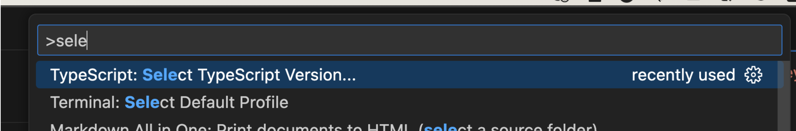
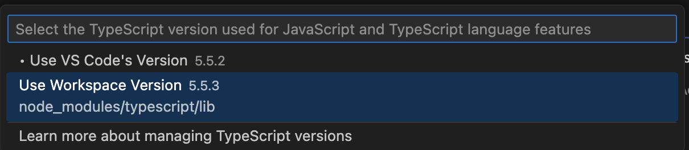

# VSCode で自分だけ typescript のエラーが異なる時に試したこと

人によって VSCode 上で怒られる typescript の内容が違う現象が発生しました。

node, yarn, 該当のライブラリのバージョン (node_module), typescript のバージョン等を調べても同じだったためパッと原因がわかりませんでした。

**結論としては、typescript が workspace のものではなく VSCode に備え付けのものが使われていたた**ことでした。

以下の手順で TypeScript を切り替えることで無事解決できました。

1. Command Palette を開く
2. Select TypeScript Version
3. Workspace を選択

**Links**

- [VSCode: Compiling TypeScript](https://code.visualstudio.com/docs/typescript/typescript-compiling#_using-newer-typescript-versions)
